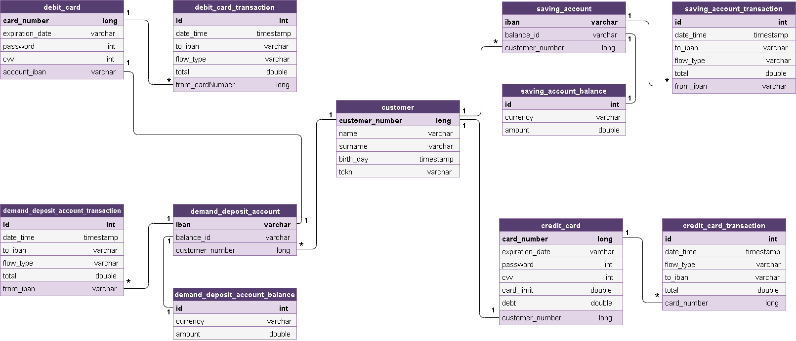

# Fibabanka Java Bootcamp Bitirme Projesi

Online bankacılık sisteminin backend servislerini içeren proje, JAVA 8 ile implemente edildi. Spring Boot, Spring MVC ve JPA kullanılarak geliştirildi.

Temel olarak bankacılık mantığının anlayıp, teknik olarak ise beklenen fonksiyonların yaratılması: müşteri, hesap, kart ve transfer işlemlerinin yönetilmesine çözüm sunuldu.

#### ER diagram

#### Bankayla ilgili;

- Müşteri yaratılırken girilen TCKN baz alınarak müşteri oluşturulur. (TCKN benzersizdir.)

- Sistemin verdiği 10 basamaklı müşteri numarası ile vadesiz mevduat hesabı, birikim hesabı ve kredi kartı oluşturulabilir.

- Hesaplara ulaşabilmek için 26 basamaklı IBAN tanımlanır. Kredi kartlarının ise 9 basamaklı kart numaraları vardır.

- Müşterinin her para biriminde bir vadesiz mevduat ve bir birikim hesabı olabilir. (ör: 2 tane "TRY" para biriminde Vadesiz Mevduat hesabı olamaz.) Hesap oluşturulurken para birimi tanımlanmalıdır.

- Her vadesiz mevduat hesabına, ilgili IBAN kullanılarak banka kartı oluşturulup, tanımlanabilir.

- Her müşterinin bir kredi kartı olabilir, para birimi "TRY"dir. Müşteri, vadesiz mevduat hesabından sadece kendi kredi kartının borcunu ödeyebilir. 

- Koşulların izin verdiği para transferlerinde, 2 taraf arasında para birimi farkı varsa, arka planda aktarılacak tutar otomatik hesaplanarak taraflara yansıtılır.
- Alışverişte kartlar kullanılır. İşlem sırasında parola ve CVV (Kart Güvenlik Kodu) doğrulaması zorunludur, kullanma tarihi geçen kartların işlem yapması engellenir.

- Alışveriş yapılacak IBAN (şirketin hesabı), bu bankada yer almıyorsa bile, alışveriş işlemi gerçekleştirilebilir.

- Sisteme girilecek her para tutarının formatı "1.234,56" şeklinde olmalıdır. (Türkiye formatı)

- Her hesabın ve kartın işlem geçmişi kendilerine ait işlem tablosunda tutulur. Para akış yönü Flow Type sütununda tutulur. Para ilgili yere giriyorsa "Inflow", çıkıyorsa "Outflow" olarak tanımlanır.

#### REST API'lar 

##### Müşteri Yönetimi

- POST     /api/customer
- PUT       /api/customer/{customerNumber}
- DELETE /api/customer/{customerNumber}

##### Hesap Yönetimi

###### Vadesiz Mevduat Hesabı

- POST     /api/account/demanddepositaccount/{customerNumber}

- DELETE /api/account/demanddepositaccount/{iban}
- GET       /api/account/demanddepositaccount/balance/{iban}

###### Birikim Hesabı

- POST     /api/account/savingaccount/{customerNumber}

- DELETE /api/account/savingaccount/{iban}
- GET       /api/account/savingaccount/balance/{iban}

##### Kart Yönetimi

###### Banka Kartı

- POST    /api/cards/debitcard/{iban}

###### Kredi Kartı

- POST    /api/cards/creditcard/{customerNumber}

- GET      /api/cards/creditcard/extract/{cardNumber}
- GET      /api/cards/creditcard/debtinquiry/{cardNumber}

##### Transfer Yönetimi

###### Vadesiz Mevduat Hesabı İşlemleri

- POST     /api/transaction/demanddepositaccount/tosaving/{fromIban}

- POST     /api/transaction/demanddepositaccount/todemand/{fromIban}
- POST     /api/transaction/demanddepositaccount/debtpaymenttocreditcard/{fromIban}

###### Birikim Hesabı  İşlemleri

- POST     /api/transaction/savingaccount/todemand/{fromIban}

###### Banka Kartı İşlemleri

- POST    /api/transaction/debitcard/shopping/{fromcardNumber}

- POST    /api/transaction/debitcard/depositcashtoatm/{fromcardNumber}

###### Kredi Kartı  İşlemleri

- POST     /api/transaction/creditcard/shopping/{fromcardNumber}

- POST     /api/transaction/creditcard/debtpaymenttoatm/{fromcardNumber}

